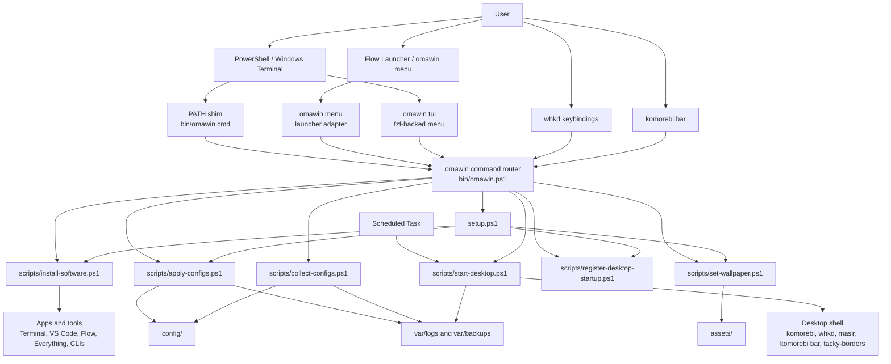

# Architecture

`omawin` should follow the same broad shape as Omarchy: keep the real behavior
in small focused commands, then expose those commands through thin terminal,
launcher, keybinding, and status-bar surfaces.

The goal is not to build one large app that owns the setup. The goal is to make
the existing scripts easy to invoke from anywhere while keeping them testable,
idempotent, and usable directly.

## Design Principles

- Scripts remain the source of truth for machine-changing behavior.
- `omawin` is the stable public command surface.
- TUI and GUI surfaces are adapters over the same commands, not separate
  implementations.
- Windows-native integration comes first: PowerShell, Windows Terminal, Flow
  Launcher, komorebi bar, `whkd`, Scheduled Tasks, and Start Menu shortcuts where useful.
- Omarchy is the product reference, but Linux-specific pieces should be
  translated deliberately instead of copied.

## Proposed Layers

| Layer | Responsibility | Examples |
| --- | --- | --- |
| Implementation scripts | Perform actual setup, config, startup, wallpaper, and install work. | `setup.ps1`, `scripts\apply-configs.ps1`, `scripts\install-software.ps1` |
| Command router | Provide a stable `omawin <group> <command>` interface and dispatch to scripts. | `bin\omawin.ps1`, `bin\omawin.cmd` |
| Terminal UI | Let users discover and run common workflows from a terminal. | `omawin tui`, likely `fzf`-backed first |
| GUI/launcher menu | Let users run the same workflows from a graphical picker. | `omawin menu`, Flow Launcher integration first |
| Desktop integrations | Bind common commands to keys, bar clicks, and startup. | `whkd`, komorebi bar, Scheduled Task |

## Command Router

The router should make common workflows available from any terminal:

```powershell
omawin setup preview
omawin setup run
omawin config apply
omawin config collect
omawin desktop start
omawin desktop status
omawin desktop register
omawin wallpaper set
omawin theme list
omawin theme set <name>
omawin commands
omawin tui
omawin menu
```

The router can start simple with a hand-written route table. Later, it can scan
script metadata in the same spirit as Omarchy's `omarchy` command center.

Useful metadata fields for future command discovery:

```powershell
# omawin:group=config
# omawin:name=apply
# omawin:summary=Apply repo configs to the current machine
# omawin:args=[-WhatIf] [-SkipVSCodeExtensions]
```

## TUI And GUI

The TUI should be the first interactive surface because it is easier to build,
debug, and keep close to the script behavior. It should call `omawin` routes
rather than invoking implementation scripts directly.

The GUI should start as a launcher/menu integration rather than a standalone
application. Flow Launcher can act as the Windows equivalent of Omarchy's
Walker-centered menu. A custom GUI can come later if the command model proves
stable and there are workflows that need richer state, previews, or forms.

## Windows Translation

| Omarchy Pattern | Omawin Translation |
| --- | --- |
| `bin\omarchy` command center | `bin\omawin.ps1` command router |
| `bin\omarchy-*` helper scripts | Existing `scripts\*.ps1` plus focused future helpers |
| Walker menu | Flow Launcher or a small `omawin menu` picker |
| `gum` terminal prompts | `fzf` or PowerShell prompts |
| `xdg-terminal-exec` wrappers | Windows Terminal `wt.exe` wrappers |
| Hyprland launch/focus helpers | `komorebi`, `whkd`, and Flow Launcher approximations |
| Waybar click actions | komorebi bar widgets where supported |
| Linux `.desktop` TUI entries | Start Menu shortcuts or Flow Launcher entries |

## System Diagram



## Open Architecture Questions

- Should the first router use a static route table, script metadata scanning, or
  a small JSON command registry?
- Should `omawin menu` integrate with Flow Launcher directly, or should Flow
  Launcher just call `omawin` commands?
- Should theme switching become a first-class command early, or wait until the
  theme file format is clearer?
- Should Start Menu shortcuts be generated for common commands, or should the
  launcher/keybinding flow be the main GUI surface?
